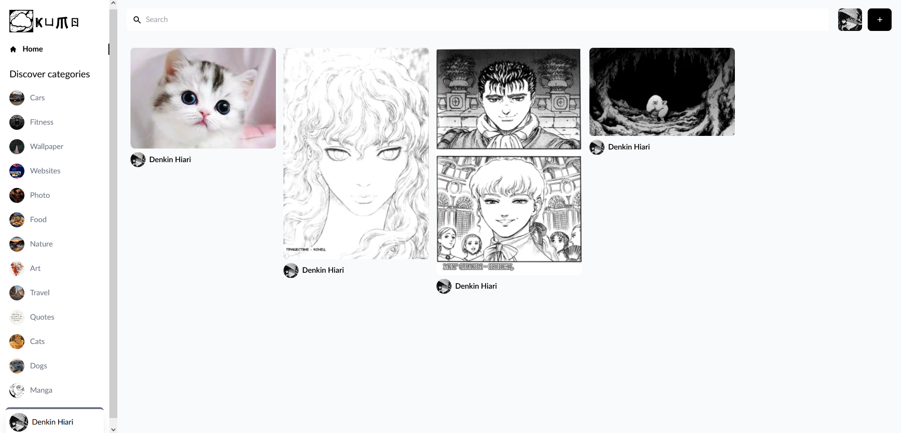

# Kumo Image Sharing Application

Kumo is platform that allows users to easily share, discover, and interact with images across various categories. Below, you'll find an overview of the key features and functionalities of application.

## Getting Started
To begin using our application, simply navigate to [not yet deployed]() and sign in using your Google account. Once logged in, you'll have access to a wide range of images and features.

## Key Features

### Google Account Integration
Application integrates seamlessly with Google accounts, providing a convenient and secure login method for users.

### Image Categories
Browse through different categories of images to discover content that interests you. Whether you're looking for animals, nature, food, or more, there is a diverse range of categories to explore.

### Image Interaction
- **Save Liked Images:** Like an image? Save it to your profile for easy access later.
- **Download Images:** Download high-quality images directly to your device.
- **Leave Comments:** Engage with other users by leaving comments on images. Share your thoughts, feedback, or simply express appreciation for stunning visuals.

### Search Functionality
Effortlessly find specific images using search functionality. Simply enter keywords or phrases related to the content you're looking for, and you will get relevant results.

